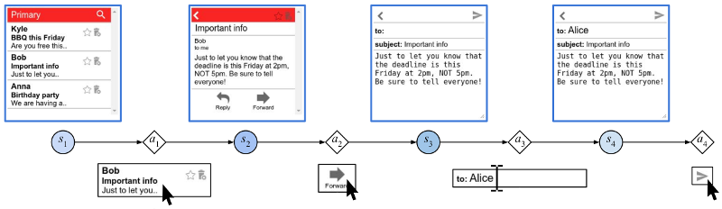
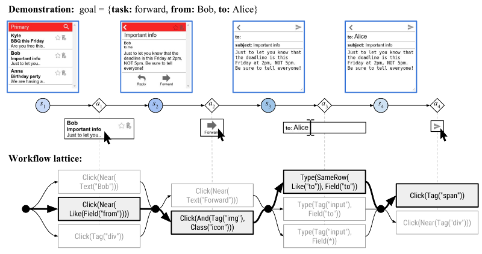
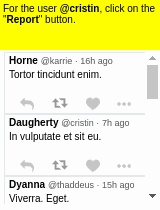
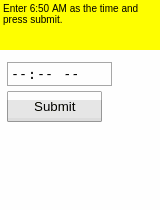
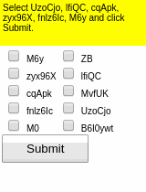
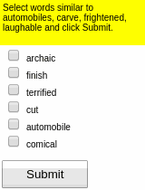
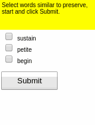
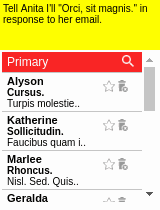

**Workflow-Guided Exploration (WGE)**
is a framework for exploring action sequences more efficiently
when a small amount of demonstrations are available.
It helps a reinforcement learning (RL) agent discover reward more quickly
even when the reward is sparse.

# Motivation and Setup

Our motivating task is learning an RL agent to use the Internet
by controlling the web browser.
Here is a simple example where the agent has to forward Bob's email to Alice:

The input goal is different for each episode,
and there can be multiple subtasks (e.g., forward an email, reply to an email, delete an email).
The agent receives a **sparse binary reward** at the end of the episode.

To aid learning,
suppose we also have access to a few (e.g., 10) human **demonstrations**
of how to complete the tasks.

# Framework Overview

Instead of directly training a model on the demonstrations
(which would lead to overfitting),
we use the demonstrations to **constrain exploration**.

* From each demonstration, we induce high-level **workflows**.
  A workflow (a path through the workflow lattice, like the one in bold)
  constrains the set of possible actions at each time step
  (e.g., the workflow step `Click(Tag("span"))` only allows actions
  that click a `` element).
  We generate many workflows with different levels of restrictiveness.

* When we perform exploration, we follow one of the workflows
  and sample actions that are within the constraints of the workflow.
  This way, the explored actions look similar to the demonstrated actions,
  so they are more likely to get positive reward.

* But there are many possible workflows, many of which are too generic or too restrictive.
  We use a simple **workflow policy** to learn which workflows are good to use.

# Demonstrations

Evaluation is done on OpenAI [Mini World of Bits](http://alpha.openai.com/miniwob/) benchmark.
To aid further research, we have [packaged and augmented the benchmark (**MiniWoB++**)](https://github.com/stanfordnlp/miniwob-plusplus)
and [released crowdsourced demonstrations](https://github.com/stanfordnlp/miniwob-plusplus-demos).

Some results of the models learned using WGE, compared with models that use behavioral cloning + RL, are shown here:

| WGE (10 demos) | BC+RL (100 demos) | BC+RL (300 demos) | BC+RL (1000 demos) |
| -- | -- | -- | -- |
|  |  |  |  |
|  |  |  |  |
|  |  |  |  |
|  |  |  |  |
|  |  |  |  |

# References

Evan Zheran Liu\*, Kelvin Guu\*, Panupong (Ice) Pasupat\*, Tianlin Shi, Percy Liang.
[**Reinforcement Learning on Web Interfaces using Workflow-Guided Exploration**](https://arxiv.org/abs/1802.08802).
ICLR 2018.
